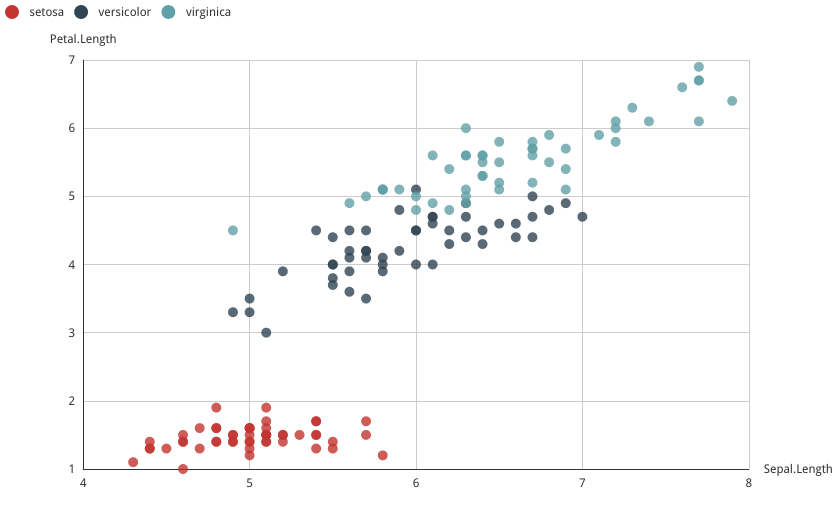

v 0.0.1 (under development)

# An R Interface to Baidu Echarts3

[Echarts3](http://echarts.baidu.com/index.html) is an open source JavaScript library developed by Baidu Inc. for interactive charts. Compared to other popular js libraries, Echarts is more Chinese-friendly. The latest stable release of Echarts3 is 3.2.3. 

This package is to facilitate `R` users to make use of Echarts3 library (use recharts package for Echarts2 library). A hello world example is as below:

```r
echartr(iris, Sepal.Length, Sepal.Width, Species) %>% setTheme('macarons')
```


> The initial `recharts` package was developed by Yang Zhou and Taiyun Wei. The current branch was forked from [Yihui Xie](https://github.com/yihui/recharts). 

# Installation

```r
if (!require(devtools)) library(devtools)
devtools::install_github('madlogos/recharts')
```

As the package is under development, you may come across errors when requiring the package directly from Github. You can alternatively download the codes from Github and compile the codes using RStudio.

# Documentation

- `R` help system
- Official online manuals
	- [中文](https://madlogos.github.io/recharts/index_cn.html)
	- [English](https://madlogos.github.io/recharts)

# Development

The package was developed using RStudio under Ubuntu 16. 

## Design

The Echarts object is an S3 list, comprising of the following elements:

(1) **Timeline contained**
```
- timeline
- options
    - series
        - list 1
        - ...
    - widgets (title, legend, toolbox, dataRange, dataZoom, roamController)
    - ...
```
(2) **No timeline contained**
```
- series
    - list 1
    - ...
- widgets (title, legend, toolbox, dataRange, dataZoom, roamController)
- ...
```

The basic design is to configure an S3 object widget by widget and concatenate them by pipe operator (%>%). It is inspired by `ggplot2`.

The core function is `echartr`, which accepts basic settings of data source, variables, chart types and then constructs the framework of the S3 object (`options` part of the Echarts DOM object).

Then `echartr` parses the data source and calls series processing functions (`series_scatter`, `series_bar`, `series_line`, ...) to build the `series` part of the `options` object.

Then you can tune the series using the low-level function `setSeries`.

Then you can add more objects (`addMarkLine`, `addMarkPoint`, `addHeatmap`, `addNameMap`, ...) to the echarts object.

Then you can configure other widgets in the echarts object created by `echartr` to create/modify the widgets. E.g, `setTitle`, `setLegend`, `setToolbox`, `setDataZoom`, `setDataRange`, `setTimeline`, `setRoam`, axes such as `setAxis`, `setPolar` and aesthetics such as `setGrid`, `setSymbols`, `setTooltip`, `setTheme`.

Finally, you can use `relocWidget`functions to relocate/resize the echarts object step further. 

## Status

### Achievements

Current version is 0.0.6. 

- Major part of core function `echartr`
- Major part of widget functions `setTitle`, `setLegend`, `setDataRange`, `setDataZoom`, `setToolbox`, `setTimeline`, `setRoam`
- Additional element functions `addMarkLine`, `addMarkPoint`, `addNameMap`, `addHeatmap`, `addGeoCoord`
- Major part of Axis/grid functions `setAxis`, `setPolar`, `setGrid`
- Major part of aesthetic function `relocWidget`, `setTheme`, `setSymbols`, `setTooltip`
- Series processing fuenctions `series_scatter`, `series_bar`, `series_line`, `series_k`, `series_pie`, `series_funnel`, `series_radar`, `series_map`, `series_force`, `series_chord`, `series_gauge`, `series_wordCloud`, `series_tree`, `series_treemap`, `series_venn`, `series_riverEvent`, `series_heatmap`

### Supported chart types

1. Mono-coordinate System
    1. Cartesian Coordinate System
        1. Scatter
            1. [scatter|bubble](http://madlogos.github.io/recharts/Basic_Plots_01_Scatterplot.html)
        1. Bar
            1. [bar|hbar](http://madlogos.github.io/recharts/Basic_Plots_02_Bar.html#horizontal-bar-chart)
            1. [vbar|column](http://madlogos.github.io/recharts/Basic_Plots_02_Bar.html#vertical-bar-column-chart)
            1. [histogram|hist](http://madlogos.github.io/recharts/Basic_Plots_02_Bar.html#histogram)
        1. Line
            1. [line](http://madlogos.github.io/recharts/Basic_Plots_03_Line.html#line-chart)
            1. [curve](http://madlogos.github.io/recharts/Basic_Plots_03_Line.html#curve-smooth-line-chart)
            1. [area](http://madlogos.github.io/recharts/Basic_Plots_03_Line.html#area-chart)
            1. [wave](http://madlogos.github.io/recharts/Basic_Plots_03_Line.html#wave-smooth-area-chart)
        1. K
            1. [k|candlestick](http://madlogos.github.io/recharts/Basic_Plots_04_K.html)
        1. eventRiver
            1. [eventRiver](http://madlogos.github.io/recharts/Basic_Plots_05_eventRiver.html)
    1. Others
        1. [Force](http://madlogos.github.io/recharts/Basic_Plots_11_Force.html)
        1. [Chord](http://madlogos.github.io/recharts/Basic_Plots_12_Chord.html)
        1. [Word Cloud](http://madlogos.github.io/recharts/Basic_Plots_13_WordCloud.html)
        1. [Venn Chart](http://madlogos.github.io/recharts/Basic_Plots_14_Venn.html)
        1. [Heatmap](http://madlogos.github.io/recharts/Basic_Plots_15_Heatmap.html)
1. Multi-coordinate System
    1. Polar Coordinate System
        1. Pie
            1. [pie](http://madlogos.github.io/recharts/Basic_Plots_21_Pie.html#pie-chart)
            1. [ring](http://madlogos.github.io/recharts/Basic_Plots_21_Pie.html#ring-chart)
            1. [Rose](http://madlogos.github.io/recharts/Basic_Plots_21_Pie.html#nightingale-rose-chart)
        1. Funnel
            1. [Funnel](http://madlogos.github.io/recharts/Basic_Plots_22_Funnel.html#funnel-chart)
            1. [Pyramid](http://madlogos.github.io/recharts/Basic_Plots_22_Funnel.html#pyramid-chart)
        1. [Radar Chart](http://madlogos.github.io/recharts/Basic_Plots_23_Radar.html)
        1. [Gauge Chart](http://madlogos.github.io/recharts/Basic_Plots_24_Gauge.html)
    1. Others
        1. [Map](http://madlogos.github.io/recharts/Basic_Plots_31_Map.html)
        1. [Tree Chart](http://madlogos.github.io/recharts/Basic_Plots_32_Tree.html)
        1. [Treemap](http://madlogos.github.io/recharts/Basic_Plots_33_Treemap.html)

## To-do

- Tool functions to configure series precisely
- Bug fix
- Optimize algorithms

# License

Under the terms of [MIT](http://www.opensource.org/licenses/mit-license.php) + file license.

-----

# 百度Echarts3的R语言接口

[Echarts3](http://echarts.baidu.com/index.html)是百度发布的一个开源JavaScript库，用于创建交互图。与其他流行的Javascript库相比，Echarts对中文更友好。Echarts家族的最新版本为3.2.3。

该加载包是为了便利`R`用户使用Echarts3库 (Echarts2库的话，用recharts包). 下面是一个hello world案例：

```r
echartr(iris, Sepal.Length, Sepal.Width, Species) %>% setTheme('macarons')
```


> `recharts`起先由Yang Zhou和Taiyun Wei开发。当前分支fork自[Yihui Xie](https://github.com/yihui/recharts)。

# 安装

```r
if (!require(devtools)) library(devtools)
devtools::install_github('madlogos/recharts')
```

此包仍在开发中，从Github直接安装可能遇到错误。可以从Github下载源代码包，然后在RStudio里编译。

# 文档

- `R`帮助系统
- 官方在线手册
	- [中文](https://madlogos.github.io/recharts/index_cn.html)
	- [English](https://madlogos.github.io/recharts)

# 开发

该包在Ubuntu 16下用RStudio开发。

## 设计

Echarts对象其实是一个S3列表，包括下列元素：

(1) **Timeline contained**
```
- timeline
- options
    - series
        - list 1
        - ...
    - widgets (title, legend, toolbox, dataRange, dataZoom, roamController)
    - ...
```
(2) **No timeline contained**
```
- series
    - list 1
    - ...
- widgets (title, legend, toolbox, dataRange, dataZoom, roamController)
- ...
```

基本设计是逐个控件地配置S3对象，并用%>%串联起来。这一思路受到了`ggplot2`启发。

核心函数是`echartr`，它接受源数据、变量、图类型等基本设置，然后构建出一个基础的S3对象框架(Echarts DOM对象的`options`部分)。

然后`echartr`解析源数据并调用数据系列处理函数(`series_scatter`, `series_bar`, `series_line`, ...)构建出`options`对象中的`series`部分。

接下来你就可以调用低级函数`setSeries`微调`series`了。

然后可以往这个Echarts对象中添加其他控件(`addMarkLine`, `addMarkPoint`, `addHeatmap`, `addNameMap`, ...)。

在然后可以在这个Echarts对象中配置其他控件的各项参数，比如`setTitle`, `setLegend`, `setToolbox`, `setDataZoom`, `setDataRange`, `setTimeline`, `setRoam`, 或者坐标轴，如`setAxis`, `setPolar` 以及美工，比如`setGrid`, `setSymbols`, `setTooltip`, `setTheme`.

最后，可以用`relocWidget`函数调整控件位置/尺寸。

## 状态

### 成果

当前版本0.0.6. 

- 核心函数`echartr`的主体
- 控件函数`setTitle`, `setLegend`, `setDataRange`, `setDataZoom`, `setToolbox`, `setTimeline`, `setRoam`的主体
- 额外控件函数`addMarkLine`, `addMarkPoint`, `addNameMap`, `addHeatmap`, `addGeoCoord`
- 坐标轴/绘图区函数`setAxis`, `setPolar`, `setGrid`
- 美工函数`relocWidget`, `setTheme`, `setSymbols`, `setTooltip`
- 数据系列处理函数`series_scatter`, `series_bar`, `series_line`, `series_k`, `series_pie`, `series_funnel`, `series_radar`, `series_map`, `series_force`, `series_chord`, `series_gauge`, `series_wordCloud`, `series_tree`, `series_treemap`, `series_venn`, `series_riverEvent`, `series_heatmap`

### 支持的图类型

1. 单坐标系
    1. 直角坐标系
        1. 散点图
            1. [scatter|bubble](http://madlogos.github.io/recharts/Basic_Plots_01_Scatterplot.html)
        1. 柱图
            1. [bar|hbar](http://madlogos.github.io/recharts/Basic_Plots_02_Bar.html#horizontal-bar-chart)
            1. [vbar|column](http://madlogos.github.io/recharts/Basic_Plots_02_Bar.html#vertical-bar-column-chart)
            1. [histogram|hist](http://madlogos.github.io/recharts/Basic_Plots_02_Bar.html#histogram)
        1. 线图
            1. [line](http://madlogos.github.io/recharts/Basic_Plots_03_Line.html#line-chart)
            1. [curve](http://madlogos.github.io/recharts/Basic_Plots_03_Line.html#curve-smooth-line-chart)
            1. [area](http://madlogos.github.io/recharts/Basic_Plots_03_Line.html#area-chart)
            1. [wave](http://madlogos.github.io/recharts/Basic_Plots_03_Line.html#wave-smooth-area-chart)
        1. K线图
            1. [k|candlestick](http://madlogos.github.io/recharts/Basic_Plots_04_K.html)
        1. 事件河流图
            1. [eventRiver](http://madlogos.github.io/recharts/Basic_Plots_05_eventRiver.html)
    1. 其他
        1. [Force](http://madlogos.github.io/recharts/Basic_Plots_11_Force.html)
        1. [Chord](http://madlogos.github.io/recharts/Basic_Plots_12_Chord.html)
        1. [Word Cloud](http://madlogos.github.io/recharts/Basic_Plots_13_WordCloud.html)
        1. [Venn Chart](http://madlogos.github.io/recharts/Basic_Plots_14_Venn.html)
        1. [Heatmap](http://madlogos.github.io/recharts/Basic_Plots_15_Heatmap.html)
1. 多坐标系
    1. 极坐标系
        1. 饼图
            1. [pie](http://madlogos.github.io/recharts/Basic_Plots_21_Pie.html#pie-chart)
            1. [ring](http://madlogos.github.io/recharts/Basic_Plots_21_Pie.html#ring-chart)
            1. [Rose](http://madlogos.github.io/recharts/Basic_Plots_21_Pie.html#nightingale-rose-chart)
        1. 漏斗图
            1. [Funnel](http://madlogos.github.io/recharts/Basic_Plots_22_Funnel.html#funnel-chart)
            1. [Pyramid](http://madlogos.github.io/recharts/Basic_Plots_22_Funnel.html#pyramid-chart)
        1. [Radar Chart](http://madlogos.github.io/recharts/Basic_Plots_23_Radar.html)
        1. [Gauge Chart](http://madlogos.github.io/recharts/Basic_Plots_24_Gauge.html)
    1. 其他
        1. [Map](http://madlogos.github.io/recharts/Basic_Plots_31_Map.html)
        1. [Tree Chart](http://madlogos.github.io/recharts/Basic_Plots_32_Tree.html)
        1. [Treemap](http://madlogos.github.io/recharts/Basic_Plots_33_Treemap.html)

## 下一步

- 更多工具函数，以便精确设置数据系列
- 修补bug
- 优化算法

# 许可

[MIT](http://www.opensource.org/licenses/mit-license.php) + file license
